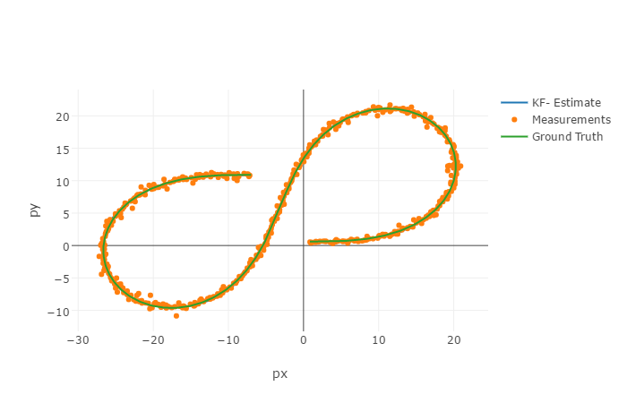
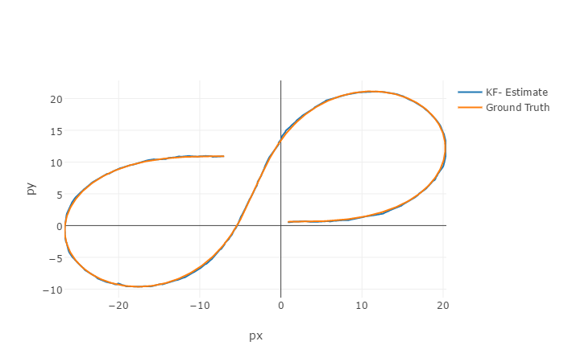

# Extended Kalman Filter Project Solution
Self-Driving Car Engineer Nanodegree Program

This project is first project under Sensor Fusion topic of Term2. The objective of this project is designing Extended Kalman Filter to estimate the position px, py and velocity vx,vy of the object being tracked by fusing the noisy sensor measurements from LIDAR and RADAR.The implementation is in C++ and uses the starter code provided by udacity(forked).

## Repository files structure

* **src**: This folder has source code of the project
     - main.cpp : Modified to take first RADAR measurement for initialization of state vector to have velocity information
     - tools.cpp : Implements the function for RMSE and Jacobian matrix calculations.
     - FusionEKF.cpp : Initializes the EKF and calls predict and updation functions
     - kalman_filter.cpp: Implements the predict function and updation functions(LIDAR standard KF and RADAR Extended KF)
     
* **data**: Has input data obj_pose-laser-radar-synthetic-input.txt
* **results**: Has EKF output file obj_pose-laser-radar-ekf-output.txt, logs and plots.
     
 
## Results with plots

To differentiate clearly KF-estimate line and Ground Truth line plots, only those are plotted as below:

The plots are obtained using Sensor Utilities https://github.com/udacity/CarND-Mercedes-SF-Utilities

The RMSE accuracy obtained as :[px,py,vx,vy] --> [0.0935411, 0.0848205, 0.310778, 0.423821] against the thresholded (mentioned as rubric)[.11, .11, 0.52, 0.52]

## Running the code
1. Clone this repo.
2. Make a build directory: `mkdir build && cd build`
3. Compile: `cmake .. && make` 
   * On windows, you may need to run: `cmake .. -G "Unix Makefiles" && make`
4. Run it: `./ExtendedKF ../data/obj_pose-laser-radar-synthetic-input.txt obj_pose-laser-radar-synthetic-output.txt > logs.log

